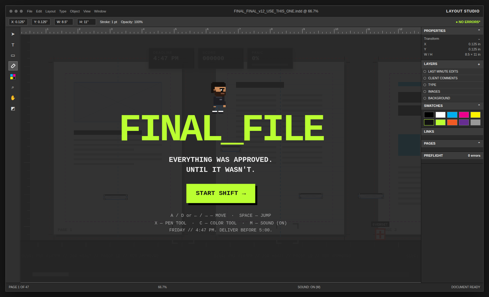

# FINAL_FILE

**Everything was approved. Until it wasn't.**

A browser-based arcade Easter egg for my design portfolio. You play a pixel-art
version of me — a Production Design Director — running through the inside of
a fictional page-layout app, fixing production problems (low-res images,
missing fonts, broken links, RGB-in-a-CMYK-document, "make the logo bigger,"
18 new comments...) before the 5:00 PM deadline hits.

## Play

Open `index.html` in any modern browser — no build step, no install, no
server required. It also works great served statically (see **Deploy** below).

**Controls**

| Action | Key |
|---|---|
| Move | `A` / `D` or `←` / `→` |
| Jump | `Space` |
| Pen Tool (primary weapon) | `X` |
| Color Tool (strong vs. RGB enemies) | `C` |
| Pause | `P` or `Esc` |
| Sound | `M` |

Touch controls appear automatically on phones/tablets.

## Deploy on GitHub Pages

1. Push this folder to a repo.
2. Repo **Settings → Pages → Source**: deploy from the `main` branch, root folder.
3. GitHub gives you a URL like `https://<username>.github.io/<repo>/` — that's
   the link to drop into your portfolio (or embed in an `<iframe>`).

## Tech notes

- Single self-contained `index.html` — HTML/CSS/vanilla JS, HTML5 Canvas for
  the game itself. No external assets, no dependencies, no build tooling.
- All pixel art (player, enemies, the boss) and all music/SFX are generated
  procedurally in code (Canvas drawing + WebAudio), so there's nothing to
  license or host separately.
- Respects `prefers-reduced-motion`, pauses when the tab/window loses focus,
  and is designed to be tunable — enemy stats, dialogue, level layout, and
  difficulty all live in clearly-labeled config blocks near the top of the
  `<script>`.
- A full run is designed to take about a minute, so it's easy for a recruiter
  or hiring manager to actually finish it.

---

James Georgeff — Production Design Director
